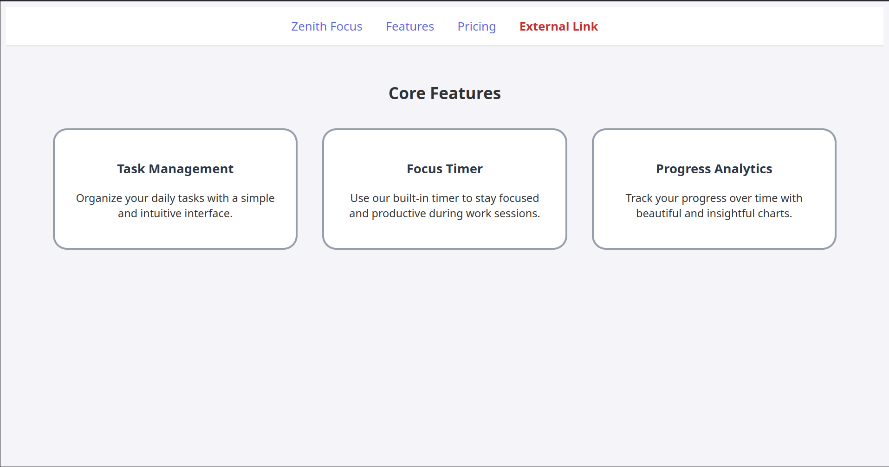

# 🖌️CSS - Design to Code

You are going to practice the basics of `css` by completing the following project.
Do your best to apply what you have learned in readings/videos.
After your attempt, the instructor will code their version.

## 🏁 STEPS

1. Follow AND read the following HTML guide:
   [HTML GUIDE](https://www.w3schools.com/htmL/html5_syntax.asp)

2. Your task is to create a website that **_closely_** resembles (looks as close
   as possible) to the one found under `/design` folder <br>

<br>

3. Your folder structure should look like

```
.

├── index.html
├── styles.css


0 directories, 2 files
```

---

3. In this project you can **_ONLY AND MUST_** use:

```HTML
<header>
<h1>
<nav>
<ul>
<li>
<a>
<main>
<section> <!-- only once! -->
<article>
<h2>
<h3>
<p>
```

4. As for `css`, only `display: inline`, `display: block`,
   and `display: inline-block` are the values allowed.

---

## 😃 Start coding

- Remember to follow excellent quality control procedures (i.e., no space in
  folders or names, HTML indentation/spacing, closing tags, etc.)
- Use a style guide -
  [HTML Style Guide](https://www.w3schools.com/htmL/html5_syntax.asp)
